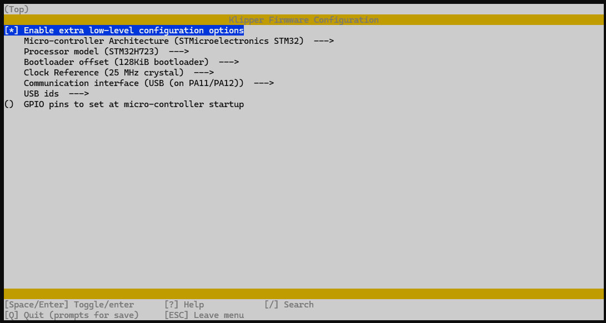
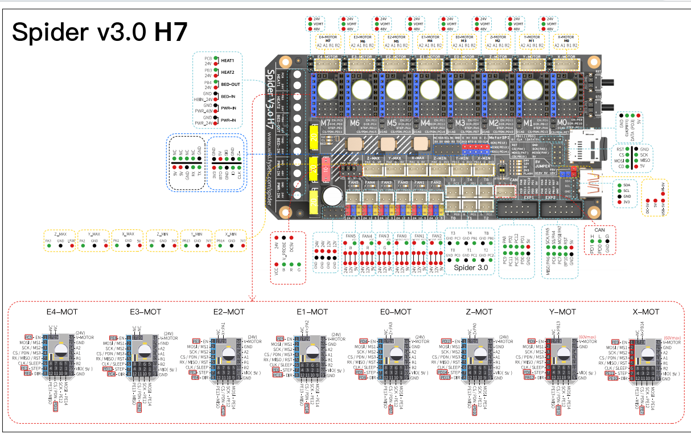

# FYSETC Spider v3 H7

The FYSETC Spider on steroids, amp up your printer build with our most powerful Spider to date, while maintaining our existing and well supported form factor. Compatible with Klipper, RepRap Firmware and Marlin

## Features vs F446 version

- STM32H723VGT6 @ 550Mhz
- Independent Motor Power input, 60V Peak (removed one MOSFET ouptut)
- Voltage Selector on every Driver
- 120uF/63V Capacitor for Motor Driver 
- DotStar RGB Support

## Included

1 x FYSETC Spider V3 H7

2 x 5 Double DuPont Cable 

30 x Jumper Caps

1x USB Type C - USB A Cable

## Flashing for Klipper

### USB 

- [*] Enable extra low-level configuration options 
- Micro-controller Architecture (STMicroelectronics STM32)
- Processor model (STM32H723)
- Bootloader offset (128KiB bootloader)
- Clock Reference (25 Mhz crystal)
- Communication interface (USB (on PA11/PA12))
- USB ids (leave default)
- () GPIO pins to set at micro-controller startup

### CAN

Coming Soon

### CAN Bridge 

Coming Soon (if compatible)

## GPIO and Pin Assignments 

